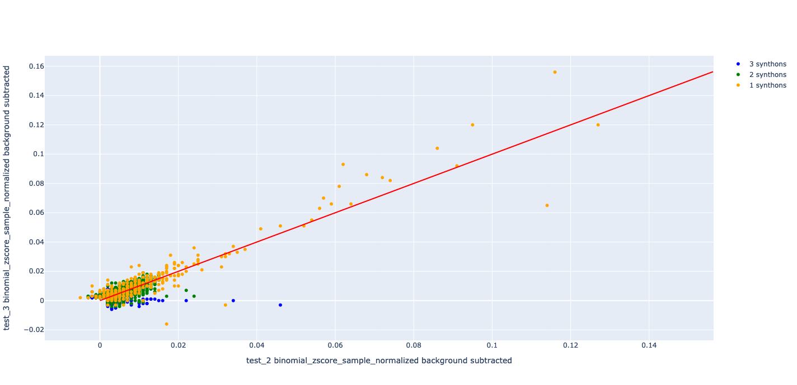
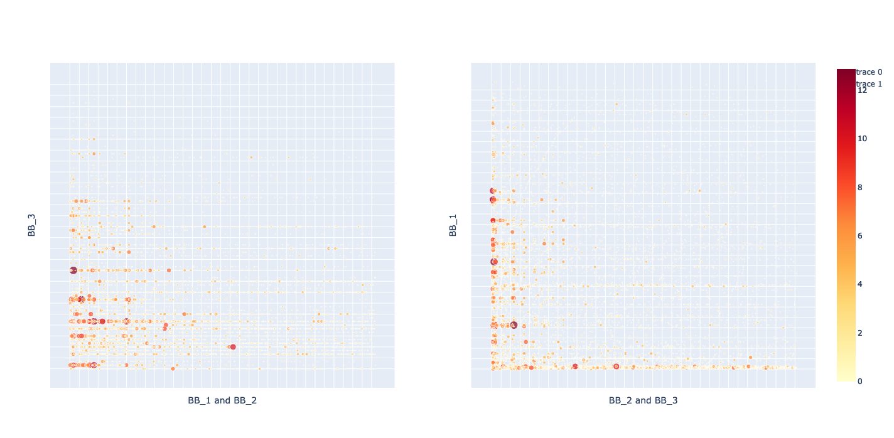
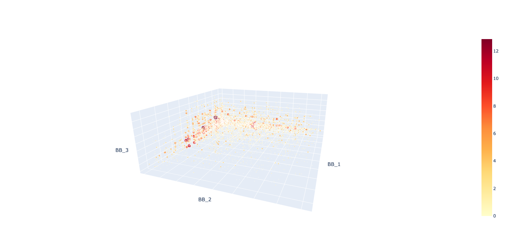

# DEL-Analysis
DNA encoded library analysis.  This is companion software to DEL-Decode for outputing analysis and graphs.

## Table of Contents
<ul>
<li><a href=#installation>Installation</a></li>
<li><a href=#files-needed>Files Needed</a></li>
<li><a href=#methods>Methods</a></li>
<li><a href=#run>Run</a></li>
</ul>

## Installation

Anaconda python required for the instructions below

### Download and move into directory

```
git clone https://github.com/Roco-scientist/DEL-Analysis.git
cd DEL-Analysis
```

### Create a del environment

```
conda create -n del python=3
conda activate del
pip install -r requirements.txt
```

### Build DEL-Analysis

```
python3 -m pip install --upgrade build
python3 -m build
```

### Install DEL-Analysis

```
pip install ./dist/delanalysis-0.0.1-py3-none-any.whl
```

## Files Needed
Output files from DEL-Decode

## Methods

### Common to merged data and sample data

Used with either delanalysis.read_merged() or delanalysis.read_sample() objects

<table>
<tr>
<th>Method</th> <th>Description</th>
</tr>
<tr>
<td>building_block_columns()</td> <td>returns all column names which contain building block info</td>
</tr>
<tr>
<td>data_columns()</td> <td>returns all column names which contain data</td>
</tr>
<tr>
<td>data_descriptor()</td> <td>Returns data_type with underscores for file output</td>
</tr>
<tr>
<td>data_type</td> <td>The data type of the DelData</td>
</tr>
<tr>
<td>to_csv(out_file)</td> <td>Writes the DelData object to the out_file in csv format</td>
</tr>
<tr>
<td>zscore(inplace=False)</td> <td>z-scores the data</td>
</tr>
</table>

### Merged data

Used with delanalysis.read_merged() which creates a DelDataMerged object

<table>
<tr>
<th>Method</th> <th>Description</th>
</tr>
<tr>
<td>quantile_normalize(inplace=False)</td> <td>quantile normalizes the data</td>
</tr>
<tr>
<td>subtract_background(background_name, inplace=False)</td> <td>subtracts the background_name sample from all other samples</td>
</tr>
<tr>
<td>reduce(min_score, inplace=False)</td> <td>Removes all rows from the data where no samples have a score above the min_score</td>
</tr>
<tr>
<td>merge(deldata, inplace=False)</td> <td>Merges merged DelData sets together</td>
</tr>
<tr>
<td>sample_data(sample_name)</td> <td>Returns a DelDataSample object from the DelDataMerged object.  This is needed for the 2d and 3d graph</td>
</tr>
<tr>
<td>select_samples(sample_names: List, inplace=False)</td> <td>Reduces the data to the listed sample names</td>
</tr>
</table>

### Sample data

Used with delanalysis.read_sample() which creates a DelDataSample object

<table>
<tr>
<th>Method</th> <th>Description</th>
</tr>
<tr>
<td>reduce(min_score, inplace=False)</td> <td>reduces the data to only data greater than the min_score</td>
</tr>
<tr>
<td>max_score()</td> <td>Returns the maximum score within the data</td>
</tr>
<tr>
<td>data_column()</td> <td>Returns the data column name</td>
</tr>
</table>

### delanalysis methods

<table>
<tr>
<th>Method</th> <th>Description</th>
</tr>
<tr>
<td>delanalysis.comparison_graph(DelDataMerged, x_sample, y_sample, out_dir, min_score=0)</td> <td>Outputs a comparison graph of x_sample vs y_sample names. Only works with DelDataMerged objects</td>
</tr>
<tr>
<td>delanalysis.graph_2d(DelDataSample, out_dir, min_score=0)</td> <td>Produces two subplot 2d graphs for the different barcodes of a DelDataSample. Will not work with DelDataMerged objects</td>
</tr>
<tr>
<td>delanalysis.graph_3d(DelDataSample, out_dir, min_score=0)</td> <td>Produces 3d graphs for the different barcodes of a DelDataSample. Will not work with DelDataMerged objects</td>
</tr>
</table>

## Run

### Start

```
conda activate del
python
```

### Working with merged data output

All code below is within python<br><br>

```
import delanalysis

# Import merged data output from DEL-Decode.  This creates a DelDataMerged object
merged_data = delanalysis.read_merged("test_counts.all.csv")

# zscore, then quantile_normalize, then subtract background which is 'test_1'
merged_data_transformed = merged_data.zscore().quantile_normalize().subtract_background("test_1")

# Create a 2d comparison graph between 'test_2' and 'test_3' in the current directory and with a low end cutoff of 4
delanalysis.comparison_graph(merged_data_transformed, "test_2", "test_3", "./", 4)

# Creates a DelDataSample object from a single sample from the merged object
test_2_data_transformed = merged_data_transformed.sample_data("test_2")

# Create a 3d graph with each axis being a barcode within the current directory and a low end cutoff of 4
delanalysis.graph_3d(test_2_data_transformed, "./", 4)

# Create a 2d graph within the current directory and a low end cutoff of 4
delanalysis.graph_2d(test_2_data_transformed, "./", 4)
```

### Working with sample data output

All code below is within python<br><br>

```
import delanalysis

# Import sample data output from DEL-Decode.  This creates a DelDataSample object
sample_data = delanalysis.read_sample("test_1.csv")

# zscore
sample_data_zscore = sample_data.zscore()

# Create a 3d graph with each axis being a barcode within the current directory and a low end cutoff of 4
delanalysis.graph_3d(sample_data_zscore, "./", 4)

# Create a 2d graph within the current directory and a low end cutoff of 4
delanalysis.graph_2d(sample_data_zscore, "./", 4)
```

### Resulting graphs

From delanalysis.comparison_graph()<br>

<br>

From delanalysis.graph_2d()<br>

<br>

From delanalysis.graph_3d()<br>

<br>
